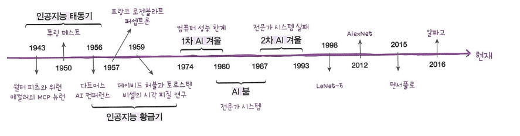
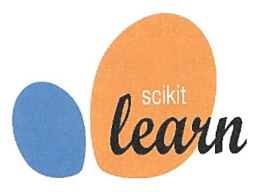
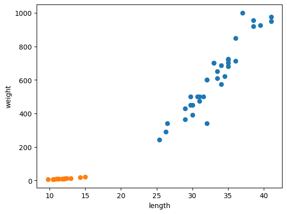
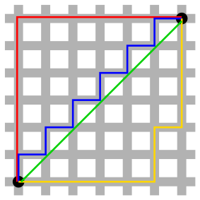

# 01. 나의 첫 머신러닝

## 01-1 인공지능과 머신러닝, 딥러닝



* 인공지능: 사람처럼 학습하고 추론할 수 있는 지능을 가진 컴퓨터 시스템을 만드는 기술
    * **인공일반지능** 혹은 **강인공지능**: 흔히 영화 속의 인공지능
    * **약인공지능**: 현실에서 우리가 마주하고 있는 인공지능으로, 특정 분여에서 사람의 일을 도와주는 보조 역할만 가능하다.

---    

* 머신러닝: 규칙을 일일히 프로그래밍하지 않아도 자동으로 데이터에서 규칙을 학습하는 알고리즘을 연구하는 분야이다.
    * 통계학에서 유래된 머신러닝 알고리즘이 많으며 통계학과 컴퓨터 과학 분야가 상호 작용하면서 발전하고 있다.
    * 사이킷런: 컴퓨터 과학 분야의 대표적인 머신러닝 라이브러리
    

---

* 딥러닝: 많은 머신러닝 알고리즘 중에 **인공 신경망**을 기반으로 한 방법들을 통칭하여 부르는 말
* 딥러닝 라이브러리: 구글의 *텐서플로*, 페이스북의 *파이토치*


## 01-2 코랩과 주피터 노트북
* 코랩: 구글 계정이 있으면 누구나 사용할 수 있는 **웹 브라우저 기반의 파이썬 코드 실행 환경**
* 셀: 코랩에서 실행할 수 있는 **최소 단위**
* 노트북: 코랩의 프로그램 작성 단위이며 일반 프로그램 파일과 달리 대화식으로 프로그램을 만들 수 있다. 코드, 코드의 실행 결과, 문서를 모두 저장하여 보관 가능
* 코랩 노트북은 **구글 클라우드의 가상 서버를 사용**함

## 01-3 마켓과 머신러닝

### 생선 분류 문제
> 생선의 길이가 30cm 이상이면 도미이다.
```python
# 도미 데이터
bream_length = [25.4, 26.3, 26.5, 29.0, 29.0, 29.7, 29.7, 30.0, 30.0, 30.7, 31.0, 31.0,
                31.5, 32.0, 32.0, 32.0, 33.0, 33.0, 33.5, 33.5, 34.0, 34.0, 34.5, 35.0,
                35.0, 35.0, 35.0, 36.0, 36.0, 37.0, 38.5, 38.5, 39.5, 41.0, 41.0]

bream_weight = [242.0, 290.0, 340.0, 363.0, 430.0, 450.0, 500.0, 390.0, 450.0, 500.0, 475.0, 500.0,
                500.0, 340.0, 600.0, 600.0, 700.0, 700.0, 610.0, 650.0, 575.0, 685.0, 620.0, 680.0,
                700.0, 725.0, 720.0, 714.0, 850.0, 1000.0, 920.0, 955.0, 925.0, 975.0, 950.0]

# 빙어 데이터
smelt_length = [9.8, 10.5, 10.6, 11.0, 11.2, 11.3, 11.8, 11.8, 12.0, 12.2, 12.4, 13.0, 14.3, 15.0]

smelt_weight = [6.7, 7.5, 7.0, 9.7, 9.8, 8.7, 10.0, 9.9, 9.8, 12.2, 13.4, 12.2, 19.7, 19.9]
```

* 분류: 머신러닝에서 여러 개의 종류(혹은 클래스) 중 하나를 구별하는 문제
    * 이진 분류: 2개의 클래스 중 하나를 고르는 문제

---

* 특성(feature): 데이터의 특징
```python
# 첫 번째 도미
bream_length[0] = 25.4 # 특성 1. 도미의 길이
bream_weight[0] = 242.0 # 특성 2. 도미의 무게
```
---

* 산점도: $x$, $y$축으로 이뤄진 좌표계에 두 변수의 관계를 표현하는 방법
    ```python
    import matplotlib.pyplot as plt

    plt.scatter(bream_length, bream_weight) # 도미 데이터 
    plt.scatter(smelt_length, smelt_weight) # 빙어 데이터
    plt.xlabel('length')
    plt.ylabel('weight')
    plt.show()
    ```

    

---
### 첫 번째 머신러닝 프로그램

```python
length = bream_length + smelt_length
#  [ length[0], length[35] ) : 도미(bream) 35개 길이
#  [ length[35], length[49] ) : 빙어(smelt) 14개 길이
weight = bream_weight + smelt_weight
#  [ weight[0], weight[35] ) : 도미(bream) 35개 무게
#  [ weight[35], weight[49] ) : 빙어(smelt) 14개 무게
``` 

```python
fish_data = [[l, w] for (l, w) in zip(length, weight)]
# fish_data = [ [length[0], weight[0]], [length[1], weight[1]] ... ]

# 리스트 내포(list comprehension) 구문
# zip() 함수는 나열된 리스트에서 원소를 하나씩 꺼내주는 역할
```

```python
fish_target=[1]*35+[0]*14 # 타겟리스트(정답리스트) 생성
```
---
* 파이썬에서 패키지나 모듈 전체를 임포트하지 않고 <u>특정 클래스만 임포트</u>하려면 **from ~import** 구문을 사용한다.

```python
# k-최근접 이웃 알고리즘 클래스 import
from sklearn.neighbors import KNeighborsClassifier

kn = KNeighborsClassifier()
```
---
* 모델에 데이터를 전달하여 규칙을 학습하는 **훈련**과정을 거친다.
```python
# 모델 kn에 fish_data, fish_target을 전달해 훈련
kn.fit(fish_data, fish_target)
```

```python
# 훈련이 끝난 모델에 테스트에 사용할 데이터를 넘겨주어 모델을 평가
kn.score(fish_data, fish_target) # 1.0
```

```python
# 훈련이 끝난 모델에 x값(length), y값(weight) 리스트를 주어 결과 예측(1 또는 0)
kn.predict([[30, 600], [29, 599], [10, 100]]) # array([1, 1, 0])
```
---

```python
# 가장 가까운 데이터 49개를 사용하는 k-최근접 이웃 모델
kn_49 = KNeighborsClassifier(n_neighbors=49)

kn_49.fit(fish_data, fish_target)

kn_49.score(fish_data, fish_target) # 0.7142857142857143 ~= 35/49
```

#### k-최근접 이웃 알고리즘이란?
* 어떤 데이터에 대한 답을 구할 때 주위의 다른 데이터를 보고 **다수를 차지하는 것을 정답**으로 사용한다.

* **데이터가 아주 많은 경우 사용하기 어렵다.** 
    * 데이터가 크기 때문에 메모리가 많이 필요하고 <u>직선거리를 계산하는 데도 많은 시간이 필요하기 때문이다.</u>
* 사실 어떤 규칙을 찾기보다는 **전체 데이터를 메모리에 가지고 있는 것이 전부이다.**

---
* 맨허튼 거리와 유클리드 거리
    * 빨강, 파랑, 노랑: 맨허튼 거리 / 초록: 유클리드 거리

    
